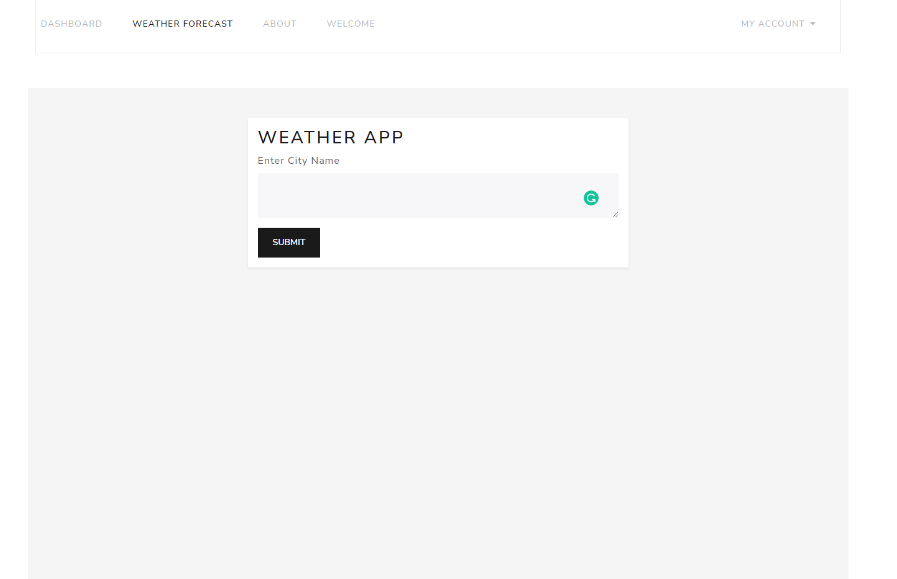
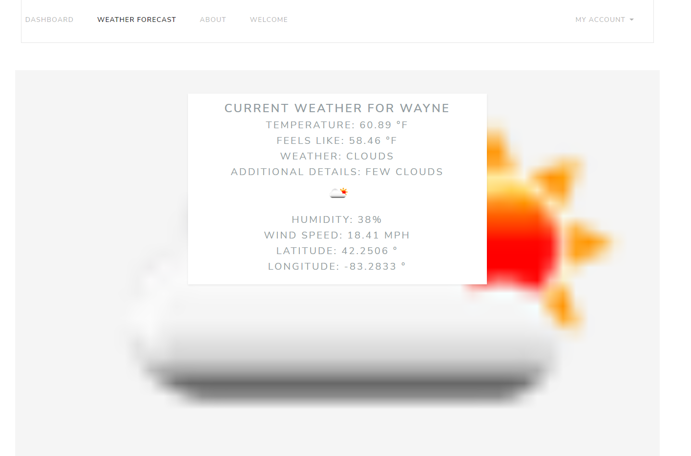

# Flask Weather App

[](https://github.com/Exodo-LS/is219_final_app/actions/workflows/prod.yml)
* [Production Deployment](https://is219-final-prod.herokuapp.com/)

[](https://github.com/Exodo-LS/is219_final_app/actions/workflows/dev.yml)
* [Developmental Deployment](https://is219-final-dev.herokuapp.com/)

# Pytest:
### project/tests/auth_test.py: 10 Tests
### project/tests/context_process_test.py: 4 Tests
### project/tests/database_validation_test.py: 1 Test
### project/tests/environment_variable_test.py: 3 Tests
### project/tests/simple_pages_test.py: 2 Tests
### project/tests/simple_pages_test.py: 5 Tests
## Total Tests: 25 Tests

# Purpose:
```
This application serves as a repurposed weather app I built in IT 202.  
I converted the app from PHP to Python.  
The user is able to input a city name.  
The user is given the temperature, what it feels like, 
the forecast with additional details, the icon for the weather,
humidity, wind speed, and coordinates. 
I do plan to add more functionality to this application.
```
# Image of Weather App:
### Weather App Form:

### Weather App Result:

ENJOY!!
